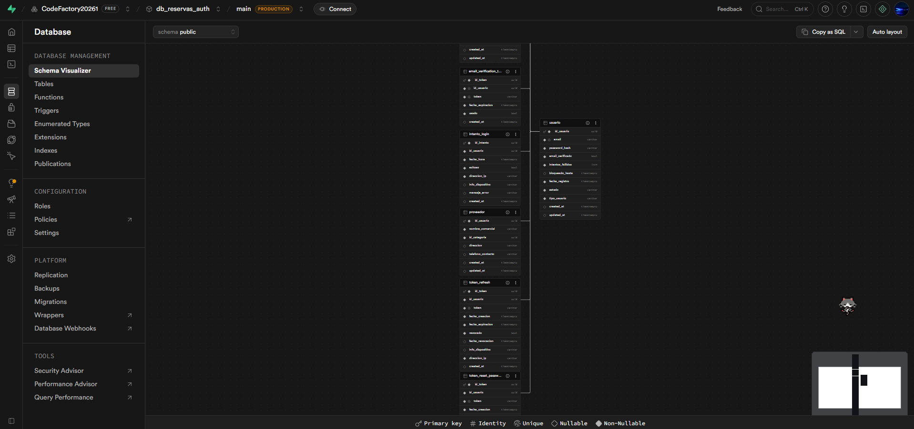
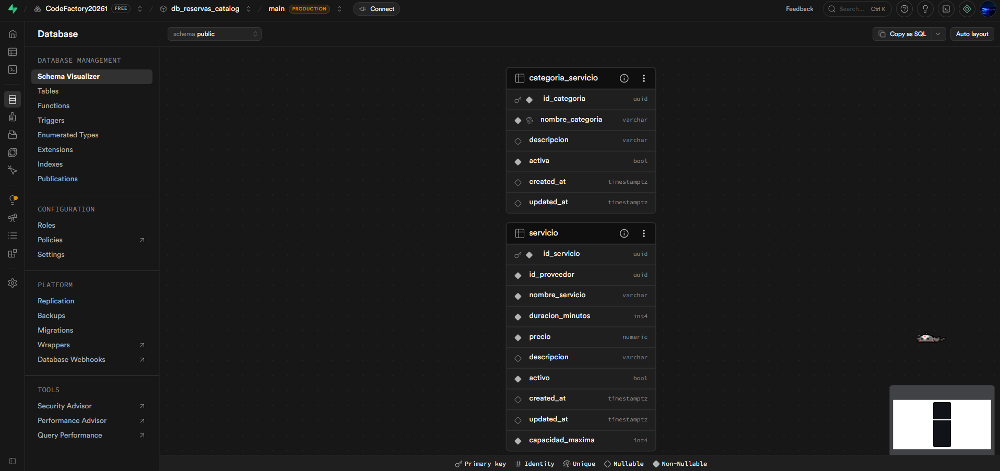
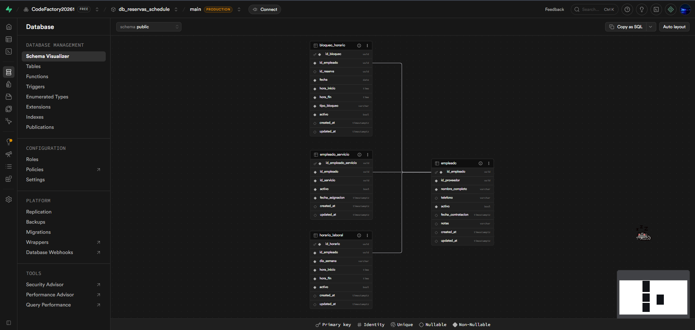
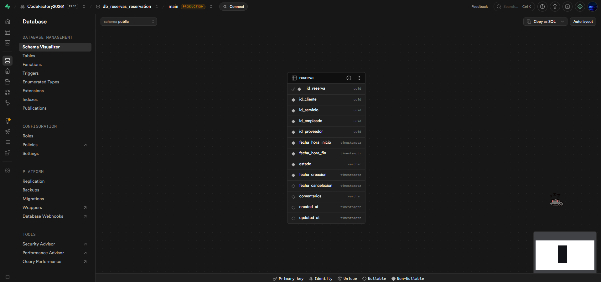

# Sprint 2

1. Refinar modelo Entidad-Relación. Se encuentran en la carpeta [MER](./MER)
    * [General](./MER/MERgeneral.png)
    * Microservicio Autenticación: [MS-Auth](./MER/MERLogico-MS-Auth.png)
    * Microservicio Catalogo de Servicios: [MS-Catalog](./MER/MERLogico-MS-Catalog.png)
    * Microservicio Horarios y Empleados: [MS-Schedule](./MER/MERLogico-MS-Schedule.png)
    * Microservicio Reservas: [MS-Reservation](./MER/MERLogico-MS-Reservation.png)
2. Crear módelo físico: [modFisico](./modFisico.md)
3. Script de despliegue:
    * Microservicio Autenticación: [MS-Auth](./DDLs/DDL%20MS-AUTH.sql)
    * Microservicio Catalogo de Servicios: [MS-Catalog](./DDLs/DDL%20MS-CATALOG.sql)
    * Microservicio Horarios y Empleados: [MS-Schedule](./DDLs/DDL%20MS-SCHEDULE.sql)
    * Microservicio Reservas: [MS-Reservation](./DDLs/DDL%20MS-RESERVATION.sql)
4. Crear consultas identificadas:
    * Microservicio Autenticación: [MS-Auth](./Consultas/ConsMS-auth.sql)
    * Microservicio Catalogo de Servicios: [MS-Catalog](./Consultas/ConsMS-catalog.sql)
    * Microservicio Horarios y Empleados: [MS-Schedule](./Consultas/ConsMS-schedule.sql)
    * Microservicio Reservas: [MS-Reservation](./Consultas/ConsMS-reservation.sql)
5. Definir volumen de datos aproximado: [volumen](./volumen.md)
6. Definición de roles y esquema de seguridad: [seguridad](./seguridad.md)

## Notas

* En el sprint 1 el proyecto era de arquitectura monolito. En este sprint 2 se realizó la migración a arquitectura por microservicios.
* En el sprint 1 la DB estaba en PostgreSQL local. Actualmente está funcionando en Supabase.
    > 
    > 
    > 
    > 
